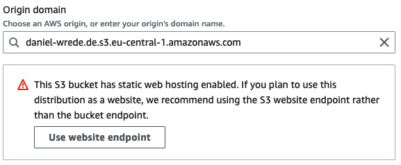

# Project Logbook

## 25. of April

- S3 Bucket Setup:
    
    Created an S3 bucket to host a static website on AWS.
    Configured the bucket's properties to enable static website hosting.
    Set up a bucket policy to allow public read access to the objects in the bucket.

- Website Deployment:
        
    Created a GitHub repository to store the website files.
    Set up a GitHub Actions workflow using a YAML file (s3_deploy.yml) to automate the deployment process.
    Used the AWS CLI within the workflow to sync the local files to the S3 bucket.

- Self-hosted Google Fonts:
    Identified the usage of Google Fonts by checking the HTML files for links to fonts.gstatic.com and fonts.googleapis.com.
    Downloaded the required font files (Open Sans and Poppins) from Google Fonts.
    Added the downloaded font files to the website's file structure.
    Created the appropriate @font-face declarations in the CSS file, linking to the locally hosted font files.
    Removed the external Google Fonts links from the HTML files.

- Testing and Verification:
    Checked the website to ensure that it's working correctly and using the self-hosted fonts.
    Used Google Chrome's Developer Tools to verify that the font requests were being made to the local files hosted on the S3 bucket.

With these steps, the website has been successfully deployed to an S3 bucket, and Google Fonts have been self-hosted to improve performance and privacy for visitors.

## 26. of April

- Discovered a guide for setting up an S3 bucket static website: https://www.alexhyett.com/terraform-s3-static-website-hosting/
- Noted that the guide is outdated and requires several additional resources: aws_s3_bucket_website_configuration, aws_s3_bucket_policy, aws_s3_bucket_ownership_controls, aws_s3_bucket_public_access_block, and aws_s3_bucket_acl
- Identified the "url_redirects" module from "operatehappy" as a potential solution for implementing redirection using just a single bucket, thereby eliminating the need for a second bucket.
- Explored other potentially relevant Terraform modules, such as the "static_website" and "s3_static_website" modules. However, due to unclear documentation, decided to return to the original guide for guidance.


- CloudFront Setup:
    Configured a CloudFront distribution using Terraform to serve the static website from the S3 bucket.
    Set up the CloudFront distribution to use the custom domain name.
    Enabled HTTPS by using AWS Certificate Manager (ACM) to create an SSL certificate for the custom domain.
    Configured CloudFront to redirect HTTP requests to HTTPS.
    Set custom error responses in the CloudFront distribution to handle 404 errors.

- Route 53 Configuration:

    Modified the Terraform code to use the existing Route 53 hosted zone for the custom domain.
    Created Route 53 records to point the custom domain and its "www" subdomain to the CloudFront distribution.

- SSL Certificate:

    Requested an SSL certificate using AWS Certificate Manager (ACM) with Terraform.
    Used the "EMAIL" validation method to validate the domain ownership.
    Configured the CloudFront distribution to use the SSL certificate for serving content over HTTPS.
    Waited for the validation email to arrive and confirmed the domain ownership.

- GitHub Actions Workflow Update:

    Updated the GitHub Actions workflow to include AWS CLI v2.
    Added a step to create an invalidation in CloudFront to clear the cache whenever the website files are updated.

- Testing and Verification:

    Checked the website using the custom domain to ensure it's working correctly and served over HTTPS.
    Verified that the CloudFront distribution is serving the content and handling custom error responses.
    Tested the GitHub Actions workflow to ensure the CloudFront cache is invalidated upon deployment.

- Cross-Origin Resource Sharing (CORS) and why it's advisable to implement it when using Amazon CloudFront for a web portfolio
- Best practices for handling both the "www" and non-"www" versions of a domain in a static website hosted on AWS S3
- How to set up URL redirects within a single S3 bucket using the operatehappy/s3-object-url-redirects/aws module
- How to redirect all requests without 'www' to the domain name with 'www' using a single S3 bucket in combination with the operatehappy/s3-object-url-redirects/aws module.
- Domain registration and WHOIS records
- AWS Route 53 for domain management and DNS
- SSL/TLS certificates and AWS ACM
- SSL certificate validation methods (Email and DNS)
- AWS S3 for object storage
- AWS CloudFront for content delivery and CDN
- Terraform IaC for AWS resource provisioning
- AWS IAM for access management
- Troubleshooting SSL certificate validation issues


## 27. of April

- succeeded receiving the SSL certificate using DNS verification
- homepage is accessible via 'www.daniel-wrede.de'
- unfortunately not via 'daniel-wrede.de':

    ```This XML file does not appear to have any style information associated with it. The document tree is shown below.
    <ListBucketResult>
    <Name>daniel-wrede.de</Name>
    <Prefix/>
    <Marker/>
    <MaxKeys>1000</MaxKeys>
    <IsTruncated>false</IsTruncated>
    </ListBucketResult>```

Route 53 records in hosted zone:

| Record name         | Type | Routing policy | Alias | Value/Route traffic to         | Evaluate target health |
|---------------------|------|----------------|-------|--------------------------------|------------------------|
| daniel-wrede.de     | A    | Simple         | Yes   | d1bmb6uxa1880d.cloudfront.net. | No                     |
| www.daniel-wrede.de | A    | Simple         | Yes   | dvuu6a5xq7plk.cloudfront.net.  | No                     |


Cloudfront distributions:

| ID            | Domain name                   | Alternate domain names | Origin name            | Origin domain                                     | Status  |
|---------------|-------------------------------|------------------------|------------------------|---------------------------------------------------|---------|
| EL0ZM13SZXHCM | d1bmb6uxa1880d.cloudfront.net | daniel-wrede.de        | S3-daniel-wrede.de     | daniel-wrede.de.s3.eu-central-1.amazonaws.com     | enabled |
| E306BUV4ZIP4WY | dvuu6a5xq7plk.cloudfront.net | www.daniel-wrede.de    | S3-www.daniel-wrede.de | www.daniel-wrede.de.s3.eu-central-1.amazonaws.com | enabled |

Comparing the Route53 and Cloudfront tables:

| Alternate domain names | daniel-wrede.de                  | www.daniel-wrede.de           |
|------------------------|----------------------------------|-------------------------------|
| Value/Route traffic to | d1bmb6uxa1880d.cloudfront.net.   | dvuu6a5xq7plk.cloudfront.net. |
| Domain name            | d1bmb6uxa1880d.cloudfront.net    | dvuu6a5xq7plk.cloudfront.net  |

Domain name from 'daniel-wrede.de' is not accessible, i.e. leads to the same error page.

Checking s3 bucket data:

| Bucket name     | Endpoint / Regional domain name | ARN                          | Static website hosting |
|---------------------|--------------------|---|---|
| daniel-wrede.de |   <http://daniel-wrede.de.s3-website.eu-central-1.amazonaws.com> | arn:aws:s3:::daniel-wrede.de | Enabled                |
| www.daniel-wrede.de |   <http://www.daniel-wrede.de.s3-website.eu-central-1.amazonaws.com> | arn:aws:s3:::www.daniel-wrede.de | Enabled    |

Comparing Cloudfront and s3 bucket tables:

| Bucket name    |  daniel-wrede.de | www.daniel-wrede.de |
|----------------|------------------|----------|
| Cloudfront Origin domain | daniel-wrede.de.s3.eu-central-1.amazonaws.com | www.daniel-wrede.de.s3.eu-central-1.amazonaws.com |
| Bucket Endpoint | <http://daniel-wrede.de.s3-website.eu-central-1.amazonaws.com> | <http://www.daniel-wrede.de.s3-website.eu-central-1.amazonaws.com> |

The Cloudfront origin domains are different from the bucket endpoints. The reason is that the Cloudfront origin domain uses the non-website (regional) domain names, while the given bucket endpoints are global. According to this [statement on stackoverflow](https://stackoverflow.com/questions/65142577/is-cloudfront-origin-using-s3-global-domain-name-performing-better-than-regional), this setup is correct and these two addresses/names serve different purpose. The non-website (regional) domain name is the fast way for Cloudfront to access the bucket, while the global bucket endpoint is the access point, if anybody wants to access the bucket (from anywhere) via browser.

Overview of todays tasks and challenges:

- Request SSL certificate via DNS verification:

    Discussed the process of requesting an SSL certificate through Amazon Certificate Manager (ACM) to secure a custom domain.
    Validated ownership of the domain using DNS verification by creating a CNAME record in Route 53. ACM provided the name and value for the CNAME record.
    After successful validation, ACM issued the SSL certificate, which can be used with CloudFront distributions to enable HTTPS for the website.

- Troubleshooting connecting without 'www' to the website:

    Investigated the issue of not being able to access the website without the 'www' prefix and reviewed the setup of Route 53, CloudFront distributions, and the S3 bucket redirection.
    Confirmed that the Route 53 records were correctly set up to point to the corresponding CloudFront distributions.
    Verified the CloudFront distributions were properly configured to use the correct S3 buckets as their origins.
    Reviewed the S3 bucket setup, ensuring that the redirect bucket was configured to redirect requests to the 'www' version of the domain.

- Objective: To create a table with expandable cells, where the first three lines of each cell are visible initially. Upon clicking on a cell, the full content is shown, and clicking again hides the full content and shows the initial preview.

    HTML Updates: Modified the table structure by adding a data-toggle attribute to each cell in the collapsible row. Wrapped the first three lines (preview content) in a div with the preview class. Wrapped the content to be shown or hidden in a div with an ID matching the data-toggle attribute and a class of collapsible-content.
    JavaScript Updates: Created a toggleRow function that handles the click event on the table cells. The function retrieves the data-toggle attribute from the clicked cell, finds the content div with the matching ID, and toggles the collapsible-content and hidden classes on the content div and clicked cell, respectively.
    CSS Updates: Added a style for the hidden class to hide the preview content when the full content is expanded.
    Implementation: Integrated the toggleRow function in the scripts.js file and added an onclick attribute to the collapsible row in the HTML file, passing the event object to the toggleRow function.

## 28. of April

- Enable Route 53 Query Logging and CloudFront Access Logs: Set up logging to diagnose issues with accessing your website through Route 53 and CloudFront.

- Analyze Route 53 Query Logs: Examine the logs in Amazon CloudWatch to identify DNS queries, status codes, client IPs, and response times to understand the requests being made to your domain.

- Analyze CloudFront Access Logs: Download log files from the Amazon S3 bucket and review them to understand HTTP requests, response codes, edge locations, and cache hit/miss status for CloudFront. This helps to identify potential issues and optimize website performance.

    ```2023-04-28 09:42:01 FRA56-C1 0 95.208.248.193 GET d1bmb6uxa1880d.cloudfront.net /favicon.ico 000 http://daniel-wrede.de/ Mozilla/5.0%20(Macintosh;%20Intel%20Mac%20OS%20X%2010.15;%20rv:109.0)%20Gecko/20100101%20Firefox/112.0 - - Error 7wT5X5JHwtL0gNOtUnLuHVxxIJQdAE1OXzUfCeLc_7ayLN3tC6NgaA== daniel-wrede.de http 308 0.008 - - - Error HTTP/1.1 - - 4910 0.000 ClientCommError - - - -```

- The caching settings for my CloudFront distribution were adjusted to improve website performance and reduce the load on my origin server. The following steps were taken:

    The website's traffic patterns and performance needs were reviewed to identify areas for improvement.
    The cache behaviors for the CloudFront distribution were adjusted to reduce the number of requests to the origin server and increase the cache hit rate. Appropriate TTLs were set for different types of content, and gzip compression was enabled.
    The origin for the CloudFront distribution was updated to point to a redirect bucket that would redirect requests to the main website bucket.
    Testing was conducted to ensure that the updated settings were working as expected and that the website was still functioning correctly.
    Monitoring of the CloudFront distribution's performance and traffic was conducted to ensure that the new caching settings were working as expected, using CloudWatch metrics and other monitoring tools.
    The caching settings were adjusted as needed based on the website's traffic patterns and performance needs.

- An assessment was made to determine whether it is necessary to request visitors' consent for the use of cookies on a static website hosted on an S3 bucket. The Firefox developer tools were utilized to examine network requests and the storage inspector to identify any stored cookies. After a thorough analysis, it was found that no cookies were being used on the website. Consequently, the decision to request visitors' consent for cookie usage may not be required. However, ongoing reviews of any third-party services or scripts utilized on the website will be conducted to ensure compliance with relevant data protection laws.
- The reason for a second s3 bucket is due to search engine optimization 'does not like' two domains pointing to the same content. More information about the setup with two s3buckets are found in this [stackoverflow post](https://stackoverflow.com/questions/37000416/how-to-redirect-non-www-to-www-in-aws-s3-bucket-and-cloudfront#37026855).
- found this [AWS official post](https://aws.amazon.com/blogs/aws/root-domain-website-hosting-for-amazon-s3/)  and [this](https://docs.aws.amazon.com/AmazonS3/latest/userguide/website-hosting-custom-domain-walkthrough.html) to set up the dns redirection and compared to my infrastructure. It's all done accordingly.


- Reconsidered the use of website_endpoint, bucket_domain_name or bucket_regional_domain_name for the origin_name in the cloudfron distribution. And, as stated on terraform.io, the 'bucket_regional_domain_name' is correct to use: <https://registry.terraform.io/providers/hashicorp/aws/latest/docs/resources/cloudfront_distribution>

    But somewhere, either on terraform or AWS side, there's pretty much confusion about the definition of these terms. I found this information in the AWS Management Console, when setting up a CloudFront distribution:

    ```"This S3 bucket has static web hosting enabled. If you plan to use this distribution as a website, we recommend using the S3 website endpoint rather than the bucket endpoint."```
    
    And it should look like this: daniel-wrede.de.s3-website.eu-central-1.amazonaws.com

    So, they recommend the s3 website endpoint, which, in terraform would be "daniel-wrede.de.s3-website.eu-central-1.amazonaws.com", while the "bucket_regional_domain_name", or better said, the "aws_s3_bucket.redirect_bucket.bucket_regional_domain_name" is in terraform "daniel-wrede.de.s3.eu-central-1.amazonaws.com". Since this is pretty confusing, I will step through each definition and present it in a table:

| Name / Term | Value |
|-------------|-------|
| AWS S3 website endpoint | daniel-wrede.de.s3-website.eu-central-1.amazonaws.com |
| AWS bucket endpoint | daniel-wrede.de.s3.eu-central-1.amazonaws.com |
| aws_s3_bucket.redirect_bucket.website_endpoint | daniel-wrede.de.s3-website.eu-central-1.amazonaws.com |
| aws_s3_bucket.redirect_bucket.bucket_regional_domain_name | daniel-wrede.de.s3.eu-central-1.amazonaws.com |
| aws_s3_bucket.redirect_bucket.bucket_domain_name | daniel-wrede.de.s3.amazonaws.com |

So as you can see, I confused it myself. The website endpoint in AWS is (luckily) identical with the website_endpoint in Terraform.

Also it is important to notice, that this is a special case for static website hosting. That is why the information shared in [this stackoverflow thread](https://stackoverflow.com/questions/65142577/is-cloudfront-origin-using-s3-global-domain-name-performing-better-than-regional), considering the S3 regional domain name ```{bucket-name}.s3.{region}.amazonaws.com``` instead of the global domain name ```{bucket-name}.s3.amazonaws.com``` is not applicable in this case.

Now let's look at the setup. According to above AWS statement, they recommend using the S3 website endpoint. According to terraform.io (link given above), the resource should be defined using the 'bucket_regional_domain_name', which is ```domain_name = "daniel-wrede.de.s3.eu-central-1.amazonaws.com"```. And when looking at the CloudFront distribution in the AWS Management Console, the Origin Domain is set to "daniel-wrede.de.s3.eu-central-1.amazonaws.com". This is clearly against the recommendations of AWS. I will attempt setting up the CloudFront distribution in the AWS Management Console, instead of using Terraform.


## 29th of April

I was finally able to make it work. Understanding, that the Terraform setup is not viable for static website hosting, using an s3 bucket. Since there's been an update to the Terraform CloudFront distribution resource, the regional domain name of the bucket is used as 'domain_name', in the AWS Management Console entitled as 'Origin domain', instead of the website endpoint. When attempting to use the s3 bucket for website hosting, this can become an issue, since features like website redirection may not be supported. The resulting behaviour is, that the website is only reachable via its' subdomain name 'www.daniel-wrede.de', but not via 'daniel-wrede.de' - which means, that the redirection does not work. When attempting to enter the website via a browser (Mozilla Firefox, in my case), the following message is shown:

    This XML file does not appear to have any style information associated with it. The document tree is shown below.
    <ListBucketResult>
    <Name>daniel-wrede.de</Name>
    <Prefix/>
    <Marker/>
    <MaxKeys>1000</MaxKeys>
    <IsTruncated>false</IsTruncated>
    </ListBucketResult>

This is also visible, when entering ```curl -v <https://daniel-wrede.de>``` into the terminal. The essence is shown and described here step by step:

- Connection established: The connection to daniel-wrede.de (IP address: 18.66.97.129) is successful on port 443, which is the default port for HTTPS connections.

      *   Trying 18.66.97.129:443...
      * Connected to daniel-wrede.de (18.66.97.129) port 443 (#0)

- TLS handshake: A successful TLS handshake occurs, ensuring secure communication between the client and the server. The connection uses TLSv1.3 with the cipher suite AEAD-AES128-GCM-SHA256.

      * SSL connection using TLSv1.3 / AEAD-AES128-GCM-SHA256

- Server certificate: The server's SSL certificate is valid, issued by Amazon, and matches the domain name daniel-wrede.de.

      *  subject: CN=daniel-wrede.de
      *  start date: Apr 27 00:00:00 2023 GMT
      *  expire date: May 25 23:59:59 2024 GMT
      *  subjectAltName: host "daniel-wrede.de" matched cert's "daniel-wrede.de"
      *  issuer: C=US; O=Amazon; CN=Amazon RSA 2048 M02
      *  SSL certificate verify ok.

- HTTP/2: The server supports HTTP/2, which enables faster and more efficient communication compared to HTTP/1.1.
 
      * Using HTTP2, server supports multiplexing

- Request: A GET request is made to the root path (/) of the domain.

        > GET / HTTP/2
        > Host: daniel-wrede.de

- Response: The server responds with a 200 status code, indicating a successful request. The content-type header indicates that the response body is an XML document.

        < HTTP/2 200 
        < content-type: application/xml

- Amazon S3 server: The response headers reveal that the server is AmazonS3, and the S3 bucket is hosted in the eu-central-1 region.

        < x-amz-bucket-region: eu-central-1
        < server: AmazonS3

- CloudFront cache status: The response was not served from CloudFront's cache and is a cache miss.

        < x-cache: Miss from cloudfront

- Response body: The XML document in the response body suggests that the S3 bucket is publicly accessible and returning a bucket content listing instead of the desired index.html file. This is the xml file, shown in the browser.

        <?xml version="1.0" encoding="UTF-8"?>
        <ListBucketResult xmlns="http://s3.amazonaws.com/doc/2006-03-01/"><Name>daniel-wrede.de</Name><Prefix></Prefix><Marker></Marker><MaxKeys>1000</MaxKeys><IsTruncated>false</IsTruncated></ListBucketResult>%

The most important from this response is, that the request is answered with a status code of 200, which means 'okay', and a list of the bucket content is sent as a reply. The bucket is empty. This indicates, what was already stated in the beginning, that the request has been forwarded to the regional domain name and therefore treated as a kind of 'read bucket files request', instead of a website request. **Expecting a response with status code 301, this is not the desired response.** This response is also accessible via an internet browser, inspecting the network responses.

Eventually there is a setup that works with Terraform, but I solved it (for now) by reconfiguring the 'domain_name'/'origin domain' in the CloudFront Management Console from using the regional domain name 'daniel-wrede.de.s3.eu-central-1.amazonaws.com' to using the (regional) website endpoint 'daniel-wrede.de.s3-website.eu-central-1.amazonaws.com', as posted in the earlier statement of AWS:



I have done this for both cloudfront distributions, since it seems to be the correct setup. This is the main step for enabling the redirection and making the website accessible via 'daniel-wrede.de'. For editing the origin settings, it is necessary to disable the cloudfront distribution. After enabling both distributions, the error still persists. First invalidating the cloudfront distributions, and thereby resetting their caches, finally enables the redirection properly, so when accessing 'daniel-wrede.de', getting redirected to 'www.daniel-wrede.de'. *Beautiful!*

## 2nd of May

- found new tutorial for a static website using s3 bucket setup: <https://medium.com/runatlantis/hosting-our-static-site-over-ssl-with-s3-acm-cloudfront-and-terraform-513b799aec0f>
- checked: it is not necessary to ask for cookie consent, since the homepage does not use cookies

## 3rd of May

- Managed to find a setup using the 'website_endpoint' directly in the cloudfront distribution configuration:

    ```terraform
    # It is necessary to use the website_endpoint here, since we are
    # redirecting to a website. Please ignore the related warning message
    # When encountering 'Error: Missing required argument' for 'origin_id'
    # reapplying the terraform should fix it
    domain_name = aws_s3_bucket.www_bucket.website_endpoint
    ```

- Following this official and recently posted doc for setting up the logging without using a public s3bucket: <https://docs.aws.amazon.com/AmazonCloudFront/latest/DeveloperGuide/AccessLogs.html>

    According to that, since April 28th 2023 it is necessary to "enable S3 access control lists (ACLs) for new S3 buckets being used for CloudFront standard logs", as it says. This is done by using an [example from terraform.io](https://registry.terraform.io/providers/hashicorp/aws/latest/docs/resources/s3_bucket_acl).

- checket license terms for the [website template](https://themewagon.com/themes/free-bootstrap-4-html-5-personal-portfolio-website-template-mark/) here: <https://themewagon.com/license/>
  
  It's free to use.

- now it's official - there is a bug in the cloudfront distribution resource, as described here:
  - <https://discuss.hashicorp.com/t/aws-cloudfront-origin-originname-bug/37997/4>
  - <https://www.reddit.com/r/Terraform/comments/114uem0/comment/j92kx8q/>

    Here I found the (implicit) solution to use the website endpoint given by the aws s3 bucket website configuration for the buckets, instead of using the bucket's own endpoints. And it works like a charme! **WOOT!**

- Found an interesting repo for static website hosting using s3 bucket: <https://github.com/subaquatic-pierre/pwa-ci-cd>
