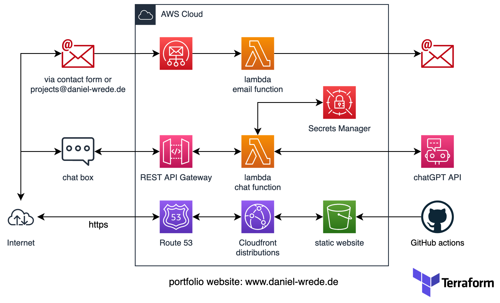

# AWS Cloud-Based Portfolio Website with ChatGPT Integration

This repository contains the Infrastructure as Code (IaC) for a personal portfolio website hosted on AWS. It includes a static S3 website, AWS Lambda functions, API Gateway, AWS Simple Email Service (SES), and a real-time chat interface powered by OpenAI's ChatGPT.

<!--  -->


## Overview

The portfolio website provides a contact form for sending emails and a real-time chat interface, implemented with AWS services for a serverless, scalable, and secure solution. Notable features include:

- 'www' and non-www redirection handled by a separate S3 bucket and CloudFront distribution.
- All buckets are private. Those with content are accessible via Origin Access Identity (for the website files served by CloudFront) and IAM role (for the chat bucket storing chat conversations).

## Architecture

The infrastructure consists of the following AWS services:

- **S3 Buckets:** Host the static website and handle redirections.
- **CloudFront Distributions:** Handle content delivery, caching, and HTTPS requests.
- **Route 53:** Connects domain names to the appropriate resources.
- **API Gateway:** Triggers the Lambda function based on the request's resource path.
- **Lambda Functions:** Handle chat interactions (ChatGPT integration) and email forwarding.
- **SES (Simple Email Service):** Manages email forwarding from the contact form to a personal email account.
- **Secrets Manager:** Stores and manages the ChatGPT API key.

The website's static content is located in this [repository](https://github.com/d-wrede/portfolio_page).

## Setup and Deployment

Resources for this project are created and managed using Terraform.

### Prerequisites

- An AWS account with configured credentials.
- Terraform installed.
- AWS CLI installed and configured.
- Python 3.6 or later.

### Steps

1. **Clone the repository.**

```bash
git clone <https://github.com/d-wrede/AWS_capstone_project.git>
cd AWS_capstone_project
```

2. **Initialize Terraform.**

```bash
terraform init
```

3. **Plan and apply the Terraform configuration.**

```bash
terraform plan
terraform apply
```

After running `terraform apply`, confirm the creation of the resources.

4. **Deploy the website contents.**

Upload your static website files to the primary S3 bucket. The files can be found [here](https://github.com/d-wrede/portfolio_page). You can automate this process using CI/CD tools like GitHub Actions.

## Usage

Once deployed, you can access the website via your domain. The contact form and chat interface should work as expected, with emails being forwarded to your personal account and chat responses being generated by ChatGPT.

## Cleanup

To avoid continued AWS charges, you can destroy the created resources with Terraform:

```bash
terraform destroy
```

Confirm the destruction when prompted.

## Contributing

Contributions, issues, and feature requests are welcome! Feel free to check the [issues page](https://github.com/d-wrede/AWS_capstone_project/issues).

<!-- ## License

Distributed under the MIT License. See `LICENSE` for more information. -->

## Contact

Daniel Wrede - <projects@daniel-wrede.de>

Project Link: <https://github.com/d-wrede/AWS_capstone_project>
